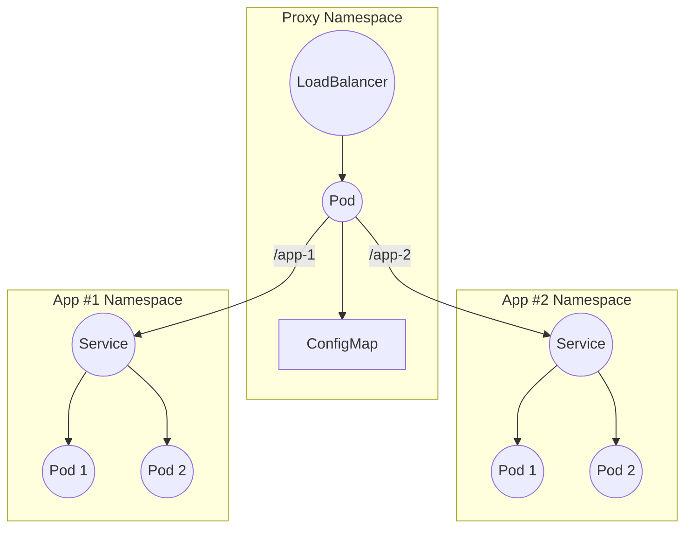

# Homelab

## K3s Setup on Raspberry Pi(s)

Using the `rpi-imager` tool:
- Select `Raspberry Pi OS 64-bit`
- Select the SD card as storage
- Set the hostname as `rp-i` where `i` is the index
- Enable password-based SSH for a user `pi`
- Configure the wireless LAN (note that Raspberry Pis currently require 2.4GHz channels)

Once written to the SD card, insert and boot the Raspberry Pi. It should boot and be assigned a dynamic IP address on the network. The router's admin console should list the connected devices and their associated IP addresses. With the IP address, you should be able to test the SSH connection by running `ssh pi@$IP` using the password set when imaging the SD card.

### Assign Static IP Addresses
Login to the router's admin console and amend the DHCP range (which may be referred to as a Pool LAN). My range was `192.168.1.64` to `192.168.1.255`. To make space for some static IP addresses, adjust the end value. For instance, `192.168.1.235` provides 20 IP addresses for static assignment.

To set the static addresses:
1. SSH to the Raspberry Pi
   ```shell
   ssh pi@$IP
   ```
2. Install `vim`
   ```shell
   sudo apt-get install vim
   ```
3. Edit `/etc/dhcpcd.conf` (or create it if it does not exist)
   ```shell
   sudo vim /etc/dhcpcd.conf
   ```
4. Add/edit the section for static addresses and add
   ```shell
   interface eth0
   static ip_address=192.168.1.244/24
   static routers=192.168.1.1
   static domain_name_servers=192.168.1.1
   ```

   In this case, set `192.168.1.244` to the static IP which you intend to set for the Raspberry Pi. Also, set `192.168.1.1` to the router's IP
5. Reboot the Raspberry Pi
   ```shell
   sudo reboot
   ```
6. After reboot, SSH to the static IP
   ```shell
   ssh pi@192.168.1.244
   ```
7. If this does not work, assign a static lease via the network router's admin console. Less elegant, but sure to work.
8. Setup `/etc/host` mappings on the local machine for each Raspberry Pi
   ```shell
   192.168.1.244 rpi-1
   ...
   192.168.1.xxx rpi-n
   ```

### Setup Password-less SSH (Optional)
This is just a quality of life option to prevent having to retype passwords when connecting to Raspberry Pis

1. Generate an SSH key on your local machine
   ```shell
   ssh-keygen
   ```
   Accept default options and don't enter a password. This will create a `~/.ssh/id_rsa` (private key) and `~/.ssh/id_rsa.pub` (public key)
2. Copy the contents of `~/.ssh/id_rsa.pub`
3. SSH to a Raspberry Pi and run:
   ```shell
   mkdir ~/.ssh
   touch ~/.ssh/authorized_keys
   chmod 0700 ~/.ssh
   chmod 0600 ~/.ssh/authorized_keys
   vim ~/.ssh/authorized_keys
   ```
   And paste the contents of the public key. Save the file
4. Repeat this for each Raspberry Pi

After this, you should be able to connect to any Raspberry Pi without entering a password

### Install K3s
1. Create a token which is used to add workers to the server:
   ```shell
   export K3S_TOKEN=$(cat /dev/urandom | tr -dc 'a-zA-Z0-9' | head -c 20)
   echo $K3S_TOKEN
   ```
2. Connect to the Raspberry Pi which will serve as the master node and execute:
   ```shell
   curl -sfL https://get.k3s.io | INSTALL_K3S_EXEC="server --token $K3S_TOKEN --disable metrics-server --disable traefik --write-kubeconfig-mode 644" sh -s -
   ```

   This command installs K3s with a couple of flags passed. If you're working with an old Raspberry Pi as the single node in your K3s cluster, it can struggle to schedule everything. To alleviate the load, we pass `--diable metrics-server`. For larger clusters, this can and probably should be enabled. The installation ships with `traefik` which provisions a load balancer for cluster access. In this case, we actually want to deploy a reverse proxy behind a custom load balancer, so we can use the `--disable traefik` flag too.
3. Connect to the Raspberry Pi(s) which will serve as worker or agent node(s) and execute:
   ```shell
   curl -sfL https://get.k3s.io | INSTALL_K3S_EXEC="agent --server ??? --token $K3S_TOKEN" sh -s -
   ```

   To retrieve the `K3S_TOKEN`, connect to the server node and run:
   ```shell
   sudo cat /var/lib/rancher/k3s/server/node-token
   ```
   The `K3S_TOKEN` is the last digits after the `:server:` string

#### Uninstall K3s
To remove K3s from a server node, SSH to the Raspberry Pi and run:
```shell
/usr/local/bin/k3s-uninstall.sh
```

To remove K3s from a worker/agent node, SSH to the Raspberry Pi and run:
```shell
/usr/local/bin/k3s-agent-uninstall.sh
```

### Configure Kubectl
It may take a couple of runs of the playbook for it to successfully install. Once completed, `kubectl` can be configured on the local machine to connect to K3s

1. Transfer the `kubeconfig` from the master node to the local machine
   ```shell
   scp pi@rpi-1:/etc/rancher/k3s/k3s.yaml ~/.kube/config-rpi-k3s
   ```
2. In the `config-rpi-k3s` file, replace the value of the server field with the IP or name of your K3s server
3. Configure the `KUBECONFIG` environment variable (add to `~/.bashrc`)
   ```shell
   export KUBECONFIG="/home/$USER/.kube/config"
   export KUBECONFIG="$KUBECONFIG:/home/$USER/.kube/config-rpi-k3s"
   ```

   On my machine, the `KUBECONFIG` requires absolute paths rather than relative
4. Use `kubectl` to check the available config contexts
   ```shell
   kubectl config get-contexts
   ```

   Ensure the Raspberry Pi K3s context has a useful name. If not, change it with:
   ```shell
   kubectl config rename-context default rpi-k3s
   ```

### Deploying a Reverse Proxy
How do we access the cluster from the home network? Since my crappy Telia router does not support adding a custom DNS server, we can deploy a reverse proxy. The structure is outlined in the graph below.



In summary, the load balancer passes requests to a `nginx` service which forwards the requests to different services depending on the URL path in the original request.

The reverse proxy is defined in a [Helm](https://helm.sh/) chart in the `helm/charts/reverse-proxy` directory. This chart is essentially a deployable package of Kubernetes resources. Ensure that [Helm is installed](https://helm.sh/docs/intro/install/).

In the `values.yaml` the `nginxConfig` must include any services which the reverse proxy can forward requests to:
```yaml
nginxConfig:
  locations:
    nginx:
      path: /test-app
      service: nginx-service
      namespace: example
```
Each application requires a new entry under `locations`. The `path` field is arbitrary and will be removed when the request is forward to the underlying service, whose name is specified in `service`.

An example of an simple, underlying application for which the chart can act as a reverse-proxy is provided below:
```yaml
apiVersion: v1
kind: Namespace
metadata:
  name: example
---
apiVersion: apps/v1
kind: Deployment
metadata:
  name: nginx-deployment
  namespace: example
  labels:
    app: nginx
spec:
  replicas: 1
  selector:
    matchLabels:
      app: nginx
  template:
    metadata:
      labels:
        app: nginx
    spec:
      containers:
      - name: nginx
        image: nginx:latest
        ports:
        - containerPort: 80
---
apiVersion: v1
kind: Service
metadata:
  name: nginx-service
  namespace: example
spec:
  selector:
    app: nginx
  ports:
    - protocol: TCP
      port: 80
      targetPort: 80
  type: ClusterIP
```

In this case, any requests to `/test-app` will be forwarded to the `nginx-service`

#### Deployment
To see the resources which the chart creates:
```shell
helm template --debug homelab helm/charts/reverse-proxy
```
Or:
```shell
helm upgrade --install homelab helm/charts/reverse-proxy --dry-run
```

To install the chart:
```shell
helm upgrade --install homelab helm/charts/reverse-proxy
```

#### Uninstalling the Chart
To uninstall the Helm chart and all corresponding resources:
```shell
helm uninstall homelab
```
